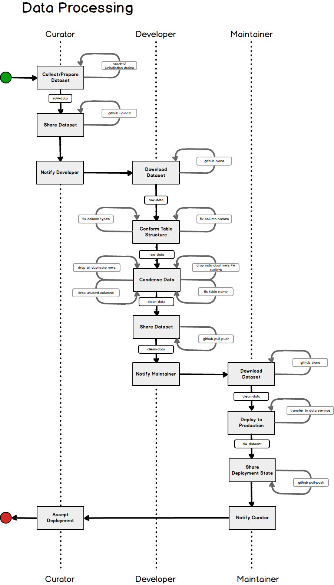

# Data.World
**SLACK CHANNEL: TBD**
# Project Description:

The idea is a sharable staging area for wrangling data before transfer to an open data portal (e.g., https://data.world).  The repo stores raw data and wrangling scripts.  Citizen Lab members can push raw data into the repo and authorized members can write scripts to prepare data for transfer to an open data portal.  

With some effort, we can create a repository of data and scripts to facilitate future data wrangling and help keep our open data manageable.

### Table of Contents
* [Definitions](#definitions)        
* [Applications](#applications)
* [Raw-data](#raw-data)
* [Clean-data](#clean-data)
* [Scripts](#scripts)
* [API](#api)
* [Installation](#installation)
* [Data Deployment](#data-deployment)
* [Data Processing](#data-processing)
* [Expectations](docs/expectations.md)
* [Wrangling](docs/wrangling.md)
### Diagrams
* [Citizen Labs Members](#members)
* [Member Roles & Responsibilities](#process-roles)
* [Member Provisioning](#prerequisites)
* [Data Flow](#data-flow)
* [Process Overview](#process-overview)

### <a id="definitions">Definitions</a>
* [Comma Separated Values](https://en.wikipedia.org/wiki/Comma-separated_values) (CSV).  CSV is a method of formatting values in a text file.
* [GitHub](https://en.wikipedia.org/wiki/GitHub) is a technology for versioning files.
* [Open Data](https://en.wikipedia.org/wiki/Open_data)
* Open Data Portal is technology that facilitates the sharing of a dataset(s) via an application programming interface (API)

## <a id="members">Citizen Labs Members</a>
Members and areas of responsibility.

| Name       | Role           | [Raw-data](raw-data/)  | [Clean-data](clean-data/) | [Scripts](scripts/) |
| :-              | :-                | :-:              | :-:                |  :-:        |
| Cara D     | Curator      | [X](raw-data/) | [X](clean-data/)  |     |
| Eileen B   | Curator      | [X](raw-data/) |    |     |
| James W | Developer  |  | [X](clean-data/) | [X](scripts/)  |
| Jace B     | Maintainer |    |    |  [X](scripts/)  |

## <a id="process-roles">Member Roles & Responsibilities</a>
Declares the duties of members.

| Curator                  | Developer                     | Maintainer                |
| :------------------      | :---------------------        | :-----------------------  |
| Curates dataset(s)       | Writes/Updates scripts        | Puts data into production |
| Loads raw dataset to GIT | Tests dataset load            | Removes data from production |
| Creates GIT pull request | Maintains GIT scripts folder  |  |
| Signoff on Prod dataset load  | Maintains clean-data folder | Maintains the GIT master branch |
|                          |  Creates clean-data set  | Maintains the Prod Environment |
|                          | Maintains Dev Environment        |  |
|                          | Creates GIT pull request     |  |
|                          | Adds raw-data  sub-folders      |  |

## <a id="prerequisites">Member Provisioning</a>

| Role | CL Membership | GHF Account | DDW Account | CLDW Account | Jupiter Notebook |
| :--    | :------------------ | :-----------------  | :-------------  | :----------------- | :---------------------|
| Curator      | [X](https://citizenlabs.org/join_us/) | [X](https://help.github.com/articles/signing-up-for-a-new-github-account/) |  |  |  |
| Developer  | [X](https://citizenlabs.org/join_us/) | [X](https://help.github.com/articles/signing-up-for-a-new-github-account/) | [X](https://data.world) |  | [X](http://jupyter.org/install) |
| Maintainer | [X](https://citizenlabs.org/join_us/) | [X](https://help.github.com/articles/signing-up-for-a-new-github-account/) |  | [X](https://data.world) | [X](http://jupyter.org/install) |
* GHF Account is GitHub Free Account
* CL Membership is Citizen Labs Membership
* DDW Account is Development Data.World Account. This is the Develpers personal account.
* CLDW Account is Citizen Labs Data.World Account
* X is a link to more info or install instructions

## <a id="applications">Applications & Datasets</a>
For every dataset in the citizenlabs/data.world repo, there exists at least one application.  For instance: the Grand River Drains data (gr_drains.csv) is used by the "Adopt a Drain" application.

| Dataset | Application |
| :-- | :-- |
| [gr_drains](raw-data/adopt-a-drain) | [Adopt a Drain](https://github.com/citizenlabsgr/adopt-a-drain) |

## <a id="raw-data">Raw-data</a>
Raw data (raw-data) is the original data provided by a client (aka, curator).  
Raw data is expected to contain text, organized in columns and rows, where values are separated by commas. The first row is required to list the name of the columns.
The Curator is responsible for putting raw data into the raw-data folder.

More info about providing raw-data can be found [here](raw-data/).

## <a id="clean-data">Clean-data</a>
Raw data doesn't always conform to the [expectations](docs/expectations.md) of an application.  
Cleaning includes: renaming columns, enforcing types, formating dates, removing duplicate rows and outliers.  
Clean data is stored in the clean-data folder.
The Developer is responsible for cleaning raw data.

More info about clean-data can be found [here](clean-data/).

## <a id="scripts">Scripts</a>
Scripts encapuslate the steps to process raw-data into clean-data and finally move data to https://data.world.
Each dataset in the raw-data folder has a script to control how it is cleaned and moved into the test or production environments.
* We use python in the form of Jupyter Notebooks to build, document, and run our scripts.
* The Developer is responsible for writing and testing scripts to clean the raw data.
* The Maintainer is responsible for running scripts that create or refesh data used by applications.

More info about scripts can be found [here](scripts/).

## <a id="api">API</a>
Each dataset has an Application Programming Interface (API).  
APIs are a common point through which to share data and services.
Once a dataset is loaded into the https://data.world portal, an API is automatically generated.  

For more information on using a https://data.world API can be found [here](https://apidocs.data.world) .

## <a id="installation">Installation</a>
The is no public installation of scripts and therefore no public or production installation.
Both Developers and Maintainers install the scripts locally on their respective computers.
Scripting does require the installation of Jupiter Notebooks

Details for local installation can be found [here](docs/INSTALL.md).

## <a id="data-deployment">Data Deployment</a>
Data is deployed to the production environment using scripts.
The Maintainer is responsible for data deployment.

Details for deployment are found [here](docs/deployment.md).

# Process

## <a id="data-flow">Data Flow</a>
The path which data moves through the process.

| Local      |    | GitHub     |    | Data.World.Test |    | Data.World.Prod |
| :-         | :- | :-         | :- | :-              | :- | :- |
| Curator    | >  | raw-data   |    |                 |    |  |
| Developer  | <  | raw-data   |    |                 |    |  |
|            | >  | clean-data | >  | test-data       |    |  |
| Maintainer | <  | clean-data |    |                 |    |  |
|            | >  |            |    |                 | >  | open-data |
| App(s)     | <  |            |    |                 | <  | open-data |

## <a id="process-overview">Process Overview</a>
This is a best case scenario with no failures. Use as a guide to a successful completion of the process.   

| Curator                 |    | Developer                  |    | Maintainer                   |
| :---------------------- | :- | :------------------------- | :- | :--------------------------- |
| Prepare Dataset |     |    |                                      |    |                              |
| Upload Dataset        |    |                                      |    |                              |
| Notify Developer      | > | Validate Raw Data        |    |                              |
|                                  |    | Test Load Data             |    |                              |
|                                  |    | Test Application           |    |                              |
|                                  |    | Notify Maintainer          | >  | Download refresh-data Branch |
|                                  |    |                            |    | Setup Prod Data Environment  |
|                                  |    |                            |    | Deploy to Production         |
|                                  |    |                            |    | Deployment Check             |
| Deployment Check        |    |                            | <  | Notify Curator               |
| Approve Deployment      |    |                            |    |                              |
| Notify Maintainer       | >  |                            |    | Update master Branch         |

## <a id="data-processing">Data Processing</a>
* Curator
* Developer
* Maintainer
